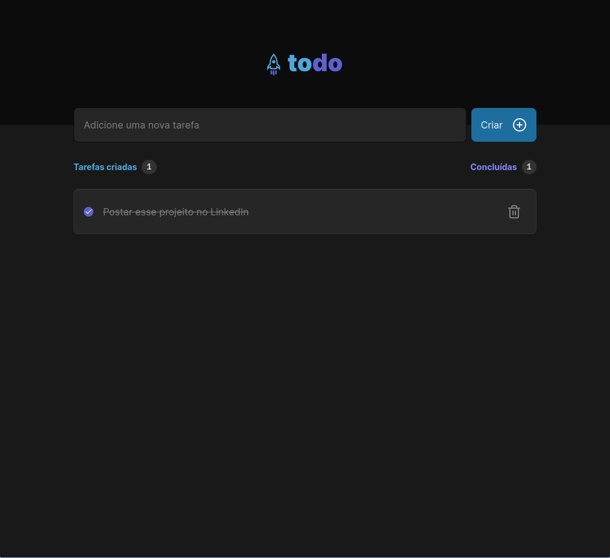

<h1 align="center"> TodoList </h1>

  <a href="#-tecnologias">Tecnologias</a>&nbsp;&nbsp;&nbsp;|&nbsp;&nbsp;&nbsp;
  <a href="#-projeto">Projeto</a>&nbsp;&nbsp;&nbsp;|&nbsp;&nbsp;&nbsp;
  <a href="#memo-licença">Licença</a>

## 🚀 Tecnologias

Esse projeto foi desenvolvido com as seguintes tecnologias:

- ReactJS
- Vite
- TailwindCSS
- Git e Github
- Figma

## 💻 Projeto

Esse projeto é um Todo List simples.

- [Acesse o projeto finalizado, online](https://todo-list-rose-sigma.vercel.app/)

## 📝 Licença

Esse projeto está sob a licença MIT.

## Team

Este projeto foi desenvolvido pela(s) seguinte(s) pessoa(s) [Jefferson Silva](https://www.linkedin.com/in/jeffsilva01/)
